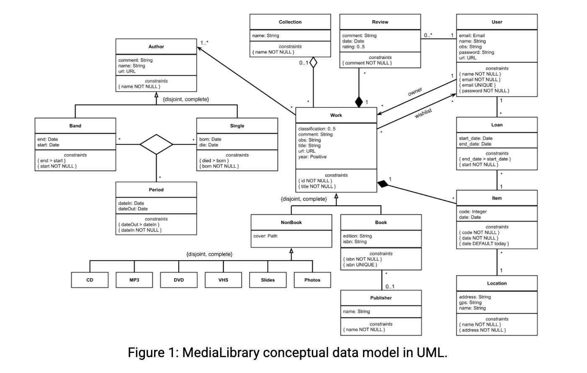

A4: Conceptual Data Model [10]
The Conceptual Domain Model contains the identification and description of the entities of the domain and the relationships between them.

At this stage of the project we are mainly interested in the database specification, thus the Conceptual Domain Model is simplified to include only concepts (entities and relationships) of the domain that are stored in the database. In this artifact the data requirements of the system are detailed. As highlighted in the LBAW Project Rules, the project dimension should lead to the identification of approximately 10 organizational entities.  

The Conceptual Data Model is obtained by using a UML class diagram containing the classes, associations, multiplicity and roles. For each class, the attributes, associations and constraints are included in the class diagram. Business rules or other restrictions not included in the class diagram are described by words or using OCL (Object Constraint Language) included as UML notes.

A4 MediaLibrary example | EBD template | A4 checklist

4. A4: Conceptual Data Model
The Conceptual Data Model contains the identification and description of the entities and relationships that are relevant to the database specification.

A UML class diagram is used to document the model.

The class diagram is developed by starting to include only the classes and its relationships in order not to overload the diagram too early in the process. In the following iterations additional detail is included, namely: class attributes, attribute domains, multiplicity of associations, and additional restrictions in OCL.

A professional diagram drawing tool that supports UML is recommended.

4.1 Class Diagram
The UML diagram in Figure 1 presents the main organizational entities, the relationships between them, attributes and their domains, and the multiplicity of relationships for the MediaLibrary platform.

4.2. Additional Business Rules
Additional business rules or restrictions that cannot be conveyed in the UML class diagram, are described in text as UML notes in the diagram or as independent notes in this section.
BR01. A user cannot loan its own items.
BR02. An item can only be lended by its owner.
BR03. An item can only be loaned to one user at a time.
